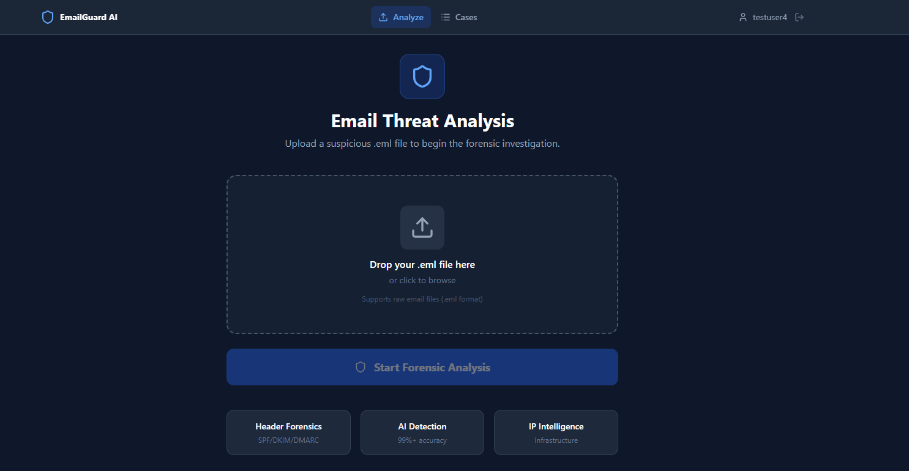

# AI-Powered Email Threat Detection & Forensic Intelligence Platform

An AI-powered cybersecurity platform for analyzing suspicious emails using email header forensics, SPF/DKIM/DMARC authentication analysis, machine-learning-based threat detection, URL analysis, IP intelligence, risk assessment, case management, and automated forensic reporting.

---

## Overview

Email-based attacks such as phishing, impersonation, credential theft, and malicious links are common cybersecurity threats.

This platform allows a user or security analyst to upload a suspicious `.eml` email and perform a structured investigation.

The system extracts email evidence, analyzes authentication and threat indicators, applies a machine-learning model, performs basic IP intelligence, calculates a risk assessment, stores the investigation as a case, and generates a forensic PDF report.

### Main Investigation Flow

```text
Suspicious Email (.eml)
          |
          v
     Email Parsing
          |
          v
     Header Analysis
          |
     +----+----+----------+
     |         |          |
     v         v          v
    SPF       DKIM       DMARC
     |         |          |
     +---------+----------+
               |
               v
      URL / Domain Analysis
               |
               v
       ML Threat Detection
               |
               v
        IP Intelligence
               |
               v
        Risk Assessment
               |
               v
        Case Management
               |
               v
       Forensic PDF Report
```

---

## Screenshots

### Login Page


### Dashboard



> Additional screenshots can be added as the project develops.

---

## Key Features

### Authentication & User Management

* User registration and authentication
* Secure password hashing using bcrypt
* JWT-based authentication
* Protected API endpoints
* User-specific case isolation

### Email Forensics

* Suspicious `.eml` email upload
* Email header extraction
* Sender and recipient analysis
* Email metadata extraction
* Header routing analysis
* Threat indicator extraction

### Email Authentication Analysis

* SPF analysis
* DKIM analysis
* DMARC analysis
* Authentication result interpretation

### Threat Detection

* Machine-learning-based phishing/threat detection
* URL and domain analysis
* Suspicious indicator detection
* Risk score calculation
* Evidence correlation

### IP Intelligence

* Extraction of relevant IP addresses
* Basic IP intelligence
* Basic IP geolocation
* IP-based investigation support

### Case Management

* Investigation case creation
* Case history
* User-specific case isolation
* Investigation evidence storage
* Case status and risk information

### Forensic Reporting

* Automated forensic report generation
* PDF report generation
* Investigation summary
* Threat indicators
* Authentication results
* Risk assessment
* Evidence summary

### Backend & API

* REST API
* FastAPI backend
* Authentication middleware
* Database integration
* Machine learning integration

---

## Tech Stack

### Frontend

* React
* JavaScript
* HTML5
* CSS3
* Vite

### Backend

* Python
* FastAPI
* Uvicorn
* PyJWT
* bcrypt

### Machine Learning

* Python
* Scikit-learn
* TF-IDF Vectorization
* Machine Learning Classification Model

### Database

* MongoDB
* PyMongo

### Security & Analysis

* SPF
* DKIM
* DMARC
* Email header analysis
* URL/domain analysis
* IP intelligence
* Basic IP geolocation

### Reporting

* ReportLab
* PDF report generation

### Deployment

* GitHub
* Render
* Vercel
* MongoDB Atlas

---

## Project Structure

```text
AI-Email-Threat-Platform/
│
├── backend/
│   ├── main.py
│   ├── requirements.txt
│   ├── seed_admin.py
│   ├── train_model.py
│   │
│   ├── ml_models/
│   │   ├── model_metadata.json
│   │   ├── phishing_classifier.pkl
│   │   └── tfidf_vectorizer.pkl
│   │
│   └── ...
│
├── frontend/
│   ├── src/
│   ├── public/
│   ├── package.json
│   ├── vite.config.js
│   └── ...
│
├── docs/
│   └── screenshots/
│       ├── login.png
│       └── dashboard.png
│
├── .env
├── .gitignore
├── README.md
└── render.yaml
```

> The exact files and folders may change as development continues.

---

# Quick Start

## 1. Clone the Repository

```bash
git clone https://github.com/26Rishabh/AI-Email-Threat-Platform.git
cd AI-Email-Threat-Platform
```

---

# Backend Setup

## 2. Navigate to Backend

```bash
cd backend
```

## 3. Create a Virtual Environment

### Windows

```bash
python -m venv venv
```

Activate it:

```bash
venv\Scripts\activate
```

### Linux / macOS

```bash
python3 -m venv venv
source venv/bin/activate
```

---

## 4. Install Dependencies

```bash
pip install -r requirements.txt
```

---

## 5. Configure Environment Variables

Create a `.env` file inside the `backend` directory.

Example:

```env
MONGO_URI=your_mongodb_connection_string
JWT_SECRET=your_secret_key
JWT_ALGORITHM=HS256
JWT_EXPIRE_MINUTES=1440
IP_API_URL=http://ip-api.com/json
APP_ENV=development
```

### Important

Do **not** put real passwords, database credentials, API keys, or JWT secrets inside the GitHub repository.

The `.env` file should remain ignored by Git.

For deployment, configure these values through the hosting platform's environment-variable settings.

---

## 6. Run the Backend

From the `backend` directory:

```bash
uvicorn main:app --reload
```

The backend will normally be available at:

```text
http://127.0.0.1:8000
```

FastAPI documentation:

```text
http://127.0.0.1:8000/docs
```

---

# Frontend Setup

## 7. Open a New Terminal

Navigate to the frontend directory:

```bash
cd frontend
```

If you are currently inside `backend`, use:

```bash
cd ../frontend
```

---

## 8. Install Frontend Dependencies

```bash
npm install
```

---

## 9. Configure Frontend Environment Variables

Create a `.env.local` file inside the `frontend` directory.

Example:

```env
VITE_API_URL=http://127.0.0.1:8000
```

Do not commit `.env.local` to GitHub if it contains environment-specific or sensitive values.

---

## 10. Start the Frontend

```bash
npm run dev
```

Vite will provide a local URL, normally similar to:

```text
http://localhost:5173
```

Open that URL in your browser.

---

# Running the Complete Application

The project requires both the frontend and backend to be running.

### Terminal 1 — Backend

```bash
cd backend
venv\Scripts\activate
uvicorn main:app --reload
```

### Terminal 2 — Frontend

```bash
cd frontend
npm run dev
```

Then open the frontend URL provided by Vite.

---

# Machine Learning Model

The platform uses a machine-learning pipeline for threat/phishing detection.

The model workflow includes:

```text
Email Data
    |
    v
Text Processing
    |
    v
TF-IDF Vectorization
    |
    v
ML Classification Model
    |
    v
Threat Prediction
    |
    v
Risk Assessment
```

Model-related files are stored in:

```text
backend/ml_models/
```

These include the trained classifier, TF-IDF vectorizer, and model metadata.

---

# Forensic Investigation Workflow

A typical investigation follows these stages:

### 1. Upload Email

The analyst uploads a suspicious `.eml` file.

### 2. Parse Email

The system extracts:

* Sender
* Recipient
* Subject
* Date/time
* Message headers
* Email body
* URLs
* IP addresses

### 3. Analyze Authentication

The platform examines:

* SPF
* DKIM
* DMARC

### 4. Analyze URLs and Domains

Suspicious URLs and domains are extracted and analyzed as threat indicators.

### 5. Machine Learning Detection

The email content is processed by the machine-learning model to identify potential phishing/threat characteristics.

### 6. IP Intelligence

Relevant IP addresses are extracted and basic IP intelligence/geolocation information is collected.

### 7. Risk Assessment

The collected evidence is correlated to produce a risk assessment.

### 8. Case Creation

The investigation can be stored as a case for later review.

### 9. Forensic Report

The platform generates a PDF containing the investigation findings and relevant evidence.

---

# Deployment

The project is designed to use separate deployment services for the frontend and backend.

## Backend — Render

The FastAPI backend can be deployed on Render.

Basic configuration:

```text
Service Type: Web Service
Environment: Python
Root Directory: backend
Build Command: pip install -r requirements.txt
Start Command: uvicorn main:app --host 0.0.0.0 --port $PORT
```

Configure the required environment variables in the Render dashboard:

```text
MONGO_URI
JWT_SECRET
JWT_ALGORITHM
JWT_EXPIRE_MINUTES
IP_API_URL
APP_ENV
```

### Important

Never commit the real values of `MONGO_URI` or `JWT_SECRET` to GitHub.

---

## Frontend — Vercel

The React/Vite frontend can be deployed using Vercel.

Basic configuration:

```text
Root Directory: frontend
Build Command: npm run build
Output Directory: dist
```

Configure:

```env
VITE_API_URL=https://your-backend-url
```

Replace the value with the deployed backend URL.

---

# Database

The application uses MongoDB for storing application and investigation data.

The backend connects to MongoDB using the `MONGO_URI` environment variable.

Example:

```env
MONGO_URI=your_mongodb_connection_string
```

The actual connection string should never be committed to the public repository.

---

# API

The backend provides REST API endpoints for functionality such as:

* Authentication
* User management
* Email upload
* Email analysis
* Threat detection
* Case management
* Report generation

When running locally, FastAPI's interactive API documentation can be accessed at:

```text
http://127.0.0.1:8000/docs
```

---

# Security Considerations

This project is intended as an educational and cybersecurity research project.

Important security practices include:

* Never commit `.env` files
* Never expose database credentials
* Never expose JWT secrets
* Use strong secrets in production
* Validate uploaded files
* Authenticate protected endpoints
* Restrict access to user-specific cases
* Treat uploaded emails and URLs as untrusted data

---

# Future Improvements

Possible future enhancements include:

* Advanced threat intelligence integrations
* More detailed IP and domain reputation analysis
* Improved ML models
* Real-time threat intelligence feeds
* Attachment malware analysis
* Advanced URL sandboxing
* More detailed email relationship graphs
* SOC dashboard integration
* Automated alerting
* Advanced forensic visualization
* Improved report customization

---

# Disclaimer

This project is developed for educational, academic, and cybersecurity research purposes.

The platform provides automated analysis to assist investigation and should not be considered a replacement for professional security investigation or incident-response procedures.

---

# Author

**Rishabh Panchal**

AI-Powered Email Threat Detection & Forensic Intelligence Platform

GitHub Repository:

https://github.com/26Rishabh/AI-Email-Threat-Platform
